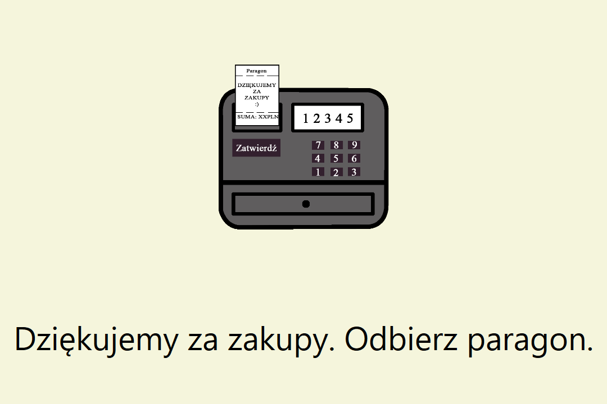
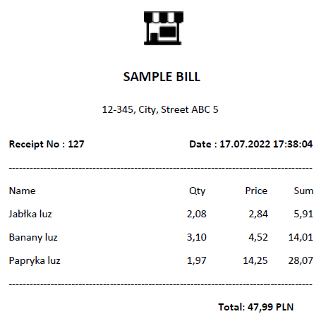
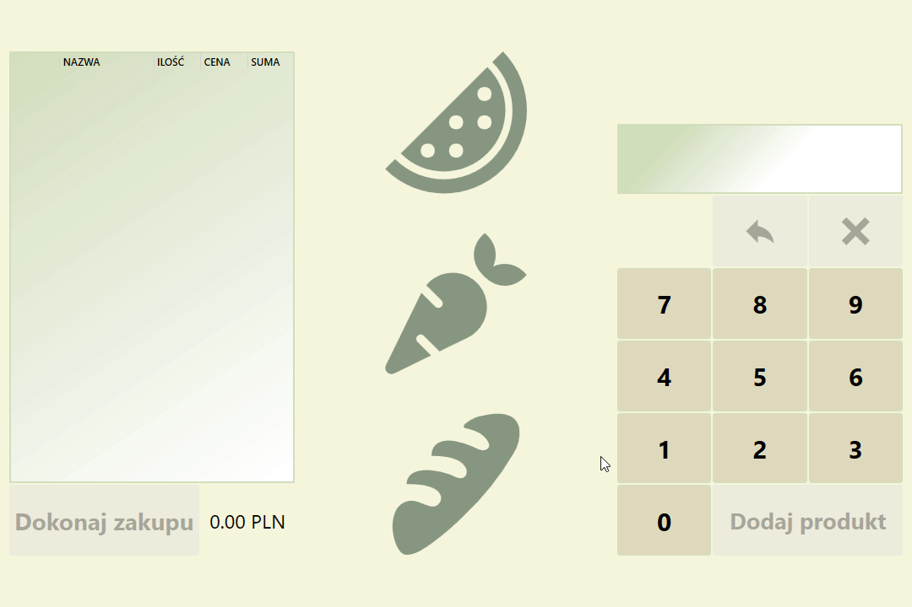
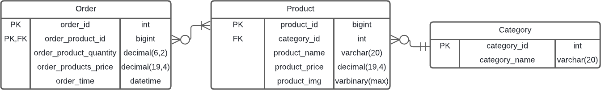

# Self-Checkout MVVM Program
Self-Checkout is interface project to enable self checkout in a store scenario. The project is developed using MVVM design pattern, is DB-First and uses example Store DB as it assumes the store should already have DB filled with products and their respective categories.

## 🔍 Overview

	
📷 Images

  	

		 
		<h4>Welcome View</h4> 
		
		<h4>Checkout View</h4> 
		
		<h4>Post Purchase View</h4> 
		
		<h4>Printed Sample Bill</h4> 
		
	

	
🎬 Checkout Example

	

		<h4>Checkout Example</h4>
		

<h3>🛠 Features</h3>
<ul>
	<li>Loading products from DB
		<ul>
			<li>Filling product categories for manual search if EAN-13 code is not known</li>
			<li>Placeholder icons for products that have no icons in DB</li>
	    </ul>
	</li>
	<li>Saving finalized order information to DB</li>
	<li>Touch screen support + keyboard input support (As a solution to barcode scanners as these work like a keyboard.)
		<ul>
			<li>Entering of digits Hotkeys</li>
			<li>Clear Screen Hotkey (Backspace)</li>
			<li>Add product to list from screen code Hotkey (E)</li>
			<li>Go back to welcome screen Hotkey (R)</li>
	    </ul>
	</li>
	<li>Support of weighted products (Currently generating random weights as placeholder for a real scale.)</li>
	<li>Printing of bills (.pdf file by default. Done By using Microsoft To Pdf Printer.)</li>
	<li>Program loop</li>
</ul>

## ⚙ How to run the program locally
⚠ Design view may not render if visual studio version is lower than 2019 16.6 and the option `Use the preview Windows Forms designer for .NET Core apps` is disabled.  
❗ By default bill printing works by printing to .pdf file in PrintOuts folder located in `bin/Debug` or `bin/Release` this may ❗ NOT work if you do not have `Microsoft Print to PDF` Printer installed. Edit `Config/Receipt.cs` PrinterName and disable `PrintToFile` or install `Microsoft Print to PDF` if that is the case.
1. Create DB named `Store` and SQL Tables - [(SQL_CreateTable.txt)](SQL_CreateTable.txt)
<kbd></kbd>
2. Insert records into tables - [Example records (without product images) - (SQL_Insert.txt)](SQL_Insert.txt)
3. Clone this repository
4. Run the project file, right click the solution and rebuild it
5. Switch the configuration from `Debug` to `Release` to run the program in fullscreen as intended without any extra controls that could create security breach
